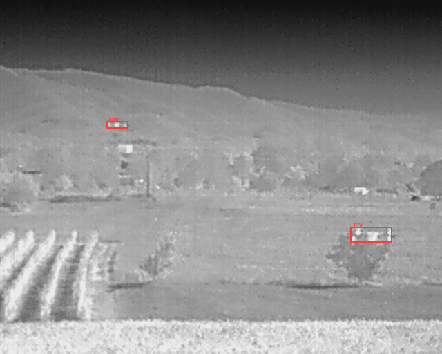
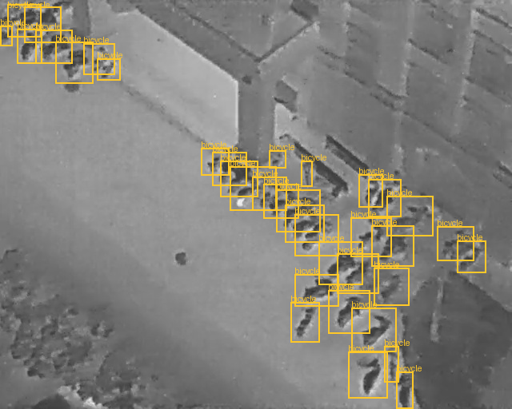

# UAV2UAV — 無人機機載熱影像辨識 (YOLOX → Kneron KL730)

無人機掛載熱像儀,機上以 KL730 NPU 即時辨識 **uav / person / vehicle / bicycle**。

## 這是什麼專案:算法 + 硬體的「系統整合」應用

本專案**不是算法研發** —— 演算法 (YOLOX) 與 AI 晶片 (Kneron KL730) 都是現成的;
我們做的是把 **演算法 + 邊緣 AI 硬體 + 熱影像資料 + 部署流程**「兜起來能在無人機上即時跑」。
這是典型的**系統整合 (systems integration)**:不發明新算法,而是讓既有元件在真實場景協同運作。

```
   熱像儀 ──▶ YOLOX (現成算法) ──▶ KL730 NPU (現成硬體) ──▶ 即時辨識結果
              └────────── 我們做的:整合、量化、部署、驗證 ──────────┘
```

### 要辨識的目標 (資料集標註示意)

系統要在熱影像中辨識的目標 —— 以下為訓練資料集的人工標註,展示任務本身:

| 空對空:辨識無人機 (UAV) | 空對地:辨識人 / 車 |
|---|---|
|  |  |
| ThermalUAV2UAV 熱影像,紅框為 UAV | HIT-UAV 熱影像,綠=person 藍=vehicle |

### 整合成果 (目前狀態)

| 整合環節 | 成果 |
|---|---|
| 演算法 → KL730 編譯 | ✅ NEF 可執行檔產出,**模擬 43.2 fps、零 CPU fallback** (整張圖全在 NPU) |
| INT8 量化 | ✅ 通過 (逐 channel corr 0.90–0.97;關鍵:raw-logit 須用 mmse range method) |
| 端到端推論鏈 | ✅ 熱影像 → NPU 推論 → decode+NMS → 出框,全鏈可跑 (`docs/images/demo/`) |
| 正式辨識精度 | ⏳ 待熱影像訓練 (目前 demo 用 COCO 預訓練權重驗證 pipeline,精準辨識需在熱影像上 fine-tune;見 [walkthrough §7.5](docs/session-walkthrough.md)) |

> 註:現有 `docs/images/demo/` 是「pipeline 實證」而非「精準辨識成果」—— 用通用 COCO 模型跑熱影像,
> domain gap 大、偵測弱,這正說明了為什麼需要熱影像訓練 (Kaggle 那一步)。訓練後將更新真實辨識結果。

## 📚 想理解整個專案?從這裡開始

> **[docs/KB/00-學習地圖.md](docs/KB/00-學習地圖.md)** ← 分層知識庫入口(由淺入深,照你想懂的深度讀)

知識庫分層:
- **L1 [問題與目標](docs/KB/01-問題與目標.md)** — 這專案要解決什麼、為什麼這樣設計(全白話)
- **L2 [核心概念](docs/KB/02-核心概念.md)** — 物件偵測/YOLO/NPU/量化 六個關鍵概念(比喻講解)
- **L3 [技術鏈總覽](docs/KB/03-技術鏈總覽.md)** — 從資料到無人機的七站,每個檔案/指令在哪
- **L4 深入** — [YOLOX 原理](docs/yolox-explained.md) · [Kneron NPU 部署筆記](docs/kneron-npu-deploy-notes.md) · [RTSP 即時辨識架構](docs/architecture/rtsp-realtime-ingestion.md)
- **L5 實戰** — [完整實驗過程與踩坑](docs/session-walkthrough.md) · [規劃與風險 PLAN](PLAN.md)
- **附錄** — [名詞解釋 glossary](docs/glossary.md) · [術語表 CONTEXT](CONTEXT.md)

## 目錄結構

```
uav2uav/
├── datasets/        下載 + 三來源 → COCO 轉檔 (含格式陷阱處理)
├── training/        訓練 docker (kneron-mmdetection) + YOLOX config
├── conversion/      ONNX → KL730 NEF (官方 toolchain docker)
├── data/            raw/ (三個資料集) + coco/annotations/ (轉檔產物, 不進 git)
├── artifacts/       onnx / nef 產物 (不進 git)
└── docs/            原理文件
```

## 端到端流程

```
┌─ 1. 資料 ────────────────────────────────────────────────┐
│ TU2U (空對空 uav, YOLO fmt) ──┐                          │
│ HIT-UAV (空對地 人/車, 偽COCO) ─┼→ 各自轉 COCO → merge    │
│ Anti-UAV410 (地對空抽幀)  ─────┘   → train/val/test.json │
└──────────────────────────────────────────────────────────┘
┌─ 2. 訓練 (docker: uav2uav-train, GPU) ───────────────────┐
│ YOLOX-s 4 類, LeakyReLU + img_norm(128/256) Kneron 版    │
└──────────────────────────────────────────────────────────┘
┌─ 3. 轉換 (docker: kneron/toolchain) ─────────────────────┐
│ ONNX(opset11) → 優化 → evaluate → INT8 PTQ → NEF("730")  │
│ + sanity check (防量化後輸出全 0)                         │
└──────────────────────────────────────────────────────────┘
┌─ 4. 部署 (KL730 板, 後續階段) ───────────────────────────┐
│ Kneron PLUS 載 NEF → NPU 推論 → A55 解碼+NMS → 下傳      │
└──────────────────────────────────────────────────────────┘
```

## CPU 開發策略 (2026-06-11 決策:本機無 GPU)

分工原則:**本機 CPU 跑通並驗證每一段管線,正式訓練丟雲端 GPU**。

| 階段 | 在哪跑 | 說明 |
|---|---|---|
| 資料轉檔 / merge | 本機 CPU | 分鐘級 |
| `make smoke` / `train-smoke` | 本機 CPU | 1 epoch × 200 張子集,驗證訓練管線會動 (~10–30 分) |
| **`make zoo-export` + `nef-zoo`** | 本機 CPU | **不需訓練**:官方 Model Zoo 預訓練 YOLOX-s (COCO 80 類) 直接走 ONNX→NEF,把 KL730 轉換鏈整條驗證完 — 本案最大技術風險可以在沒有 GPU、沒有板子的情況下先消掉 |
| 正式訓練 (`make train`) | 雲端 GPU | 見下 |
| ONNX→NEF 量化 | 本機 CPU | toolchain 本來就是 CPU 工作 |

雲端 GPU 選項 (免費優先):
- **Kaggle**:每週 30h 免費 GPU (T4/P100),可直接掛 dataset。
- **Colab**:免費 T4 (有時數限制);Pro ~US$10/月較穩。
- 流程:把本 repo + `data/coco/annotations/*.json` 上傳,raw 影像用各資料集官方來源在雲端重新下載 (比上傳快);訓練產物只需拿回 `latest.pth` (~70MB)。
- 時間估算 (T4, batch 8, 640 輸入, ~3–4 萬張, 100 epochs):約 1–2 天 (估算)。可先 50 epochs 看 val mAP 曲線再決定是否續訓。

## Quickstart (本機 CPU)

```bash
make env-build       # 建訓練 image (CPU wheel, 首次 ~10 分鐘)
make data-download   # TU2U + HIT-UAV 自動;Anti-UAV410 手動 (見下)
make data-convert    # 轉 COCO + merge + smoke 子集
make smoke           # 驗證資料/設定能被 mmdet 載入
make train-smoke     # CPU 1 epoch 子集訓練,驗證訓練管線
make zoo-export      # 官方預訓練權重 → ONNX (不需訓練)
make nef-zoo         # → KL730 NEF + sanity check (驗證整條轉換鏈)
# ── 正式訓練在雲端 GPU: make train → 拿回 latest.pth ──
make export-onnx     # 自訓 ckpt → ONNX
make nef             # → KL730 NEF
```

### Anti-UAV410 手動下載後的放法

```
data/raw/AntiUAV410/
├── train/   (200 段)
├── val/     ( 90 段)
└── test/    (120 段)
     └── <序列名>/
         ├── 000001.jpg ...   (逐幀 jpg)
         └── IR_label.json    ({"exist": [...], "gt_rect": [[x,y,w,h],...]})
```

放好後重跑 `make data-convert` 即可併入 (轉檔以 stride=10 抽幀、跳過 exist=0)。
缺這個資料集時 merge 會自動略過,TU2U + HIT-UAV 可先跑通全流程。

## 關鍵版本鎖定 (2026-06-11 查證)

| 項目 | 值 | 依據 |
|---|---|---|
| kneron-mmdetection | mmdetection 2.25.0 fork | repo `mmdet/version.py` |
| mmcv-full | 1.6.0 (允許 1.3.17–1.6.0) | `mmdet/__init__.py` assert |
| PyTorch | 1.12.1 + cu113 | mmcv-full 1.6.0 prebuilt wheel 最新組合 |
| ONNX opset | 11 (export 腳本內 assert) | `pytorch2onnx_kneron.py` |
| toolchain | `kneron/toolchain:latest` (v0.32.x), conda env `onnx1.13` | base env 不支援 730 |
| KL730 platform id | `ktc.ModelConfig(..., "730")` / `kneron_inference(..., platform=730)` | toolchain manual_3 |

## 注意事項

- **Dockerfile 目前裝 CPU wheel**。雲端 GPU 訓練時把 Dockerfile 內兩個 index 換成 cu113 (`torch==1.12.1+cu113` / mmcv `cu113/torch1.12.0`) 重建即可;Colab/Kaggle 不能跑 docker 的話,直接照 Dockerfile 內的 pip 清單在 notebook 裝同版本 (這是該環境的慣例,不違反本機「不污染系統」規則)。
- **量化校正前處理必須與訓練一致**:`x/256 − 0.5`。`conversion/convert_to_nef.py` 已寫死同一條式子,並提供 `--bgr` 開關 (官方教學有 BGR 翻轉;灰階複製 3ch 時無差)。
- **kneron-mmdetection 官方教學只示範 KL720**;730 路徑為同一 ONNX + platform 改 `"730"`,API 文件支持但無官方 e2e 範例 — 第一次 `make nef` 的 evaluate/sanity check 輸出要人工確認 (CPU fallback node、輸出非全 0)。
- 資料集授權:TU2U = MIT、HIT-UAV = CC BY 4.0、**Anti-UAV410 無 LICENSE 檔** (僅內部研究評估用)。
