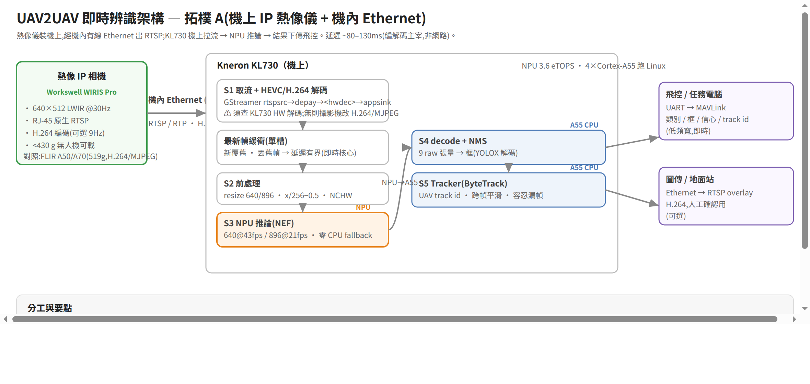

# RTSP (H.265) 即時辨識架構 — 接流到 KL730 偵測鏈

> PLAN §4.1 capture 站的延伸:影像源是 RTSP 串流(可能 H.265/HEVC)時,如何接到 KL730
> 達成即時 UAV 辨識。含架構、即時紀律、延遲預算、實測驗證、風險。
> 程式:`firmware/capture/rtsp_source.py`、`firmware/realtime_loop.py`;驗證:`firmware/test_rtsp_loopback.py`



> 架構圖原始檔 `rtsp-realtime-arch.svg`(可編輯);PNG 由 chrome-headless 轉出。

## 1. 拓樸(✅ 已定案:A — 機上 IP 攝影機 + 機內 Ethernet)

**確認 (2026-06):攝影機裝在機上,經機內 Ethernet 連接(IP camera 出 RTSP),KL730 機上拉流。**

| 拓樸 | RTSP 來源 | 延遲 |
|---|---|---|
| **A. 機上 IP 攝影機(本案)** | 攝影機經機內 Ethernet 出 RTSP,KL730 機上拉流 | **低(~80-130ms)** |
| B. 地面端處理下行 | 無人機經 RF/4G/5G 下傳,地面 KL730 收 RTSP | 高且抖(~150-350ms) |
| (對照) C. MIPI/USB 直連 | 非 RTSP | 最低 |

拓樸 A 的兩個結果:
- **網路風險基本消失**:機內有線 Ethernet(常見 GbE)→ 低延遲、低抖動、幾乎無丟包。延遲主宰項是**編碼+解碼**,不是網路。
- **RTSP 接流躲不掉**:攝影機是 Ethernet IP cam(非 MIPI sensor),「改 MIPI 直連」**不適用** —— RTSP/RTP 解碼是唯一路徑(本檔 `RtspSource` 即此)。

## 1.1 🔑 codec 選擇 = 卸載 A55 的槓桿(本案關鍵決策)

H.265 主要好處是**省頻寬**。但**機內 Ethernet 頻寬充裕**(GbE 對 640×512@30 綽綽有餘),
所以 codec 該由「**KL730 解得動嗎**」決定,不是頻寬:

| 若 KL730… | 攝影機輸出 | 理由 |
|---|---|---|
| **有** HW HEVC 解碼 | H.265 | 卸載 A55 |
| **沒有** HW HEVC | **H.264**(較輕)或 **MJPEG**(解碼極輕) | 用充裕本機頻寬換稀缺 A55 算力 |

額外好處:**MJPEG / intra-only 無 B-frame 延遲**,逐幀獨立 → 延遲比 H.265 更低,對追快速 UAV 有利。
`RtspSource`(ffmpeg auto-detect codec)不需改即支援 H.264/MJPEG。

## 1.2 相機選型(真實產品範例,2026-06 查證)

情境硬條件:熱像 LWIR + 原生 Ethernet/IP 出 RTSP + 無人機可載(輕) + 支援 H.264/MJPEG(配合 §1.1)。

| 產品 | 解析度 | 介面 / codec | 重量 | 備註 |
|---|---|---|---|---|
| **Workswell WIRIS Pro**(推薦) | 640×512 @30Hz | RJ-45 原生 **RTSP + H.264** | **<430 g** | 本來就是無人機 payload;Ethernet 為**選配**,下單須指定含 RJ-45+API 版本;功耗/價格官網未列 |
| FLIR A50 / A70 | 464×348 / **640×480** @30Hz | GigE Vision + **RTSP H.264/MJPEG**(Advanced 版)+ PoE | 519 g | codec 彈性最好、整合最省事,但偏重、解析度略低 |
| Hikvision DS-2TD2167T(對照) | 640×512 @25fps | RTSP **H.265/H.264/MJPEG** + PoE | **1.77 kg** | 純對照:成熟 IP 熱像串流堆疊,但太重,屬地面/桿上 |
| InfiRay RJ45 ASIC 模組 | 640×512 | RJ-45 板載 ASIC 壓 H.264/H.265 出 RTSP | 未查證(core 21×21mm) | 概念最貼本案、理論最輕,但重量/功耗/出口管制未查證 |

⚠️ **避雷:FLIR Boson + Ethernet Bridge(BoB)走 GigE Vision (GenICam),不是標準 RTSP** —— KL730 端不能直接當一般 RTSP 拉,除非自加轉碼板。Boson core 雖極輕(7.5g)但不合「接 RTSP」前提。

**推薦 Workswell WIRIS Pro**:唯一同時滿足全部硬條件且已商品化(<430g、640×512、RJ-45 原生 RTSP+H.264;機內頻寬充裕剛好用得上 H.264 輕 codec,KL730 直接拉流不必自製轉碼板)。

> 出口管制:≥9Hz LWIR 多落 EAR;各品牌多提供 9Hz 版。採購地域要查(見 PLAN R3)。

## 2. 🔑 最關鍵未知:KL730 是否有硬體 H.265 解碼 (VPU)

H.265 即時解碼很重。**有 HW HEVC decode** → 卸載 A55(A55 留給 decode+NMS+tracker);
**沒有** → 軟解吃掉 A55,640 都未必撐 30fps。KL730 標榜「4K@60 視訊處理 + ISP」,
但要確認那是「**壓縮串流解碼**」還是「**RAW sensor 的 ISP**」。**動手前查 datasheet/BSP**。
若無 HW HEVC(本案拓樸 A 的解法,見 §1.1):**因機內 Ethernet 頻寬充裕,直接把 IP 攝影機改設 H.264 或 MJPEG 輸出** → 軟解成本大降,不必加硬體。(MIPI 直連不適用 — 本案是 IP cam。)

## 3. 管線(解耦分段 + 即時紀律)

```
[RTSP/RTP H.265 源]
   │ RTP/UDP (低延遲;掉包但即時優先)
   ▼
(S1) 取流 + HEVC 解碼  ── board: GStreamer rtspsrc!rtph265depay!h265parse!<hwdec>!appsink(drop=true,max-buffers=1)
   │                      開發/地面: ffmpeg 子程序 → rawvideo bgr24 → pipe
   ▼
╔═ 單槽「最新幀」緩衝 (新覆舊) ═╗  ◀── 即時關鍵:不排隊、丟舊幀 → 延遲有界
   ▼
(S2) 前處理 resize→640/896、(熱影像)AGC、x/256−0.5、NCHW
   ▼
(S3) KL730 NPU 推論 (NEF) → 9 raw 張量  [Kneron PLUS async send/receive pipeline]
   ▼
(S4) decode + NMS (A55 CPU,非 NPU)  → 框
   ▼
(S5) Tracker (ByteTrack, A55) → UAV track id,跨幀平滑、容忍漏幀
   ▼
(S6) 輸出 MAVLink metadata + 選配 overlay 重編碼 RTSP 監看
```

**核心紀律:解碼率與推論率解耦。** 串流 30fps、NPU 640 約 43fps(896 約 21)。
單槽「最新幀勝出」緩衝:推論每次拿最新解碼幀,舊幀丟棄。**絕不讓佇列堆積**(堆積=延遲無限增長)。
→ 有效偵測 fps = NPU fps,延遲有界。對應程式 `LatestFrameBuffer`(board 端 GStreamer 用 `drop=true max-buffers=1` 在 HW 層做同件事)。

## 4. 延遲預算(粗估)

| 環節 | 拓樸 A | 拓樸 B |
|---|---|---|
| 編碼 H.265 | ~30-60ms | ~30-60ms |
| 網路 + jitter buffer | ~5-15ms | **~50-200ms(主宰、最難控)** |
| HEVC 解碼 | ~1 幀(HW) | ~1 幀(HW)/更多(SW) |
| 前處理+NPU(640) | ~23ms | ~23ms |
| decode/NMS + tracker | ~數ms | ~數ms |
| **合計** | **~80-130ms** | **~150-350ms** |

## 5. fps / 解析度 / tracker(接小目標分析)

UAV 50.9% <32px、22% <16px(見 `analysis/small-object-fps-tradeoff.md`)。KL730 實測:

| 輸入 | fps | 適用 |
|---|---|---|
| 640 | 43.2 | 最快,漏 <16px 小目標 |
| 896 | 21.3 | **平衡點**,小目標進 P3 可靠區 |
| 1280 | 10.1 | 小目標最佳但跌破即時 |

**ByteTrack 非必要不可**:RTSP 抖動/掉包 + 即時丟幀 + 小目標閃爍 → 偵測斷續;
tracker 維持 UAV 身分、平滑軌跡,還能「每 N 幀偵測、中間追蹤補」省算力。

## 6. 實測驗證(本機 ffmpeg loopback,2026-06)

`firmware/test_rtsp_loopback.py`,不需真攝影機/板:

| 驗證 | 結果 |
|---|---|
| 最新幀緩衝丟幀紀律 | ✅ 產 10 幀 / 取 2 次最新 / 丟 8 舊幀 / 不重取 → 延遲有界成立 |
| 真 H.265-over-RTP/UDP → 解碼 → 幀 → 緩衝 | ✅ 4 秒解碼 ~85 幀(~21fps 網路傳輸),樣本幀 512×640×3 內容正常 |

→ **ingestion 半段(取流+解碼+即時緩衝)端到端打通**;偵測半段(NPU→decode→NMS)先前已驗(43fps/零 CPU fallback/量化通過)。兩半相接即完整即時鏈。

## 7. 技術棧

- 取流+解碼:**GStreamer**(board,HW 解碼)/ **ffmpeg 子程序**(開發/地面,可攜)。
- 推論:**Kneron PLUS** C API(async send/receive pipeline 才吃得到 fps 標稱)。
- 追蹤:**ByteTrack**(純關聯、無 DL,A55 可跑)。
- 輸出:**MAVLink**(框/類別/track id)+ 選配 overlay 重編碼 RTSP。

## 8. 風險 / 驗證優先序

1. **KL730 HW H.265 解碼能力** — #1,決定可行性,查 datasheet/BSP。
2. **A55 CPU 預算** — (軟解時)HEVC 解碼 + decode/NMS + tracker 要塞進 4 核且不擠 NPU 排程。
3. **網路抖動/掉包**(拓樸 B)— 延遲主宰,考慮低延遲 profile / FEC。
4. **熱影像串流格式** — 已 AGC 後 8-bit 還是 16-bit?影響前處理。

## 9. 現況與下一步

- ✅ **拓樸已定案:A(機上 IP 攝影機 + 機內 Ethernet)**。網路風險低,RTSP 接流為唯一路徑。
- ⏳ **待查**:KL730 是否有 HW HEVC 解碼(查 BSP `gst-inspect` 找 v4l2 HW decoder)。
  - 有 → 攝影機維持 H.265。
  - 無 → 把攝影機改設 **H.264 / MJPEG**(機內頻寬足,§1.1),`RtspSource` 不需改。
- ⏳ **待補**:把 ByteTrack 接進 `realtime_loop.py` 的 tracker 槽,完成「偵測 + 追蹤」即時鏈。
- ⏳ **待測(有板後)**:`detector` 換 board backend,量機上真實端到端延遲與 fps。
